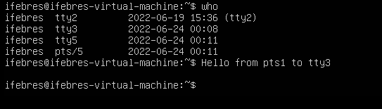

1. Какого типа команда cd? Попробуйте объяснить, почему она именно такого типа; опишите ход своих мыслей, если считаете что она могла бы быть другого типа.

> "CD" - встроенаая команда.        
Работая в сессии терминала логичнее менять указатель на текущую дерикторию внутренней функцией.
Если использовать внешний вызов, то он будет работать со своим окружением, и менять  текущий каталог внутри своего окружения, не влияя на shell.  


2. Какая альтернатива без pipe команде grep <some_string> <some_file> | wc -l? man grep поможет в ответе на этот вопрос. Ознакомьтесь с документом о других подобных некорректных вариантах использования pipe.

```
vagrant@vagrant:~$ cat test.txt
123
123
1234
afsdgsg
adasdd
dfgdfg
,nknk
vagrant@vagrant:~$ grep 123 test.txt -c
3
vagrant@vagrant:~$ grep 123 test.txt |wc -l
3
```


3. Какой процесс с PID 1 является родителем для всех процессов в вашей виртуальной машине Ubuntu 20.04?
Процесс systemd
```
vagrant@vagrant:~$ pstree -p
systemd(1)─┬─ModemManager(711)─┬─{ModemManager}(729)
           │                   └─{ModemManager}(733)
```

4. Как будет выглядеть команда, которая перенаправит вывод stderr ls на другую сессию терминала?
```
vagrant@vagrant:~$ ls -l /tmp/root 2>/dev/pts/1
```
В другой сессии
```
vagrant@vagrant:~$ who
vagrant  tty1         2022-06-19 19:43
vagrant  pts/0        2022-06-19 12:47 (10.0.2.2)
vagrant  pts/1        2022-06-19 19:45 (10.0.2.2)
vagrant@vagrant:~$ ls: cannot access '/tmp/root': No such file or directory
```


5. Получится ли одновременно передать команде файл на stdin и вывести ее stdout в другой файл? Приведите работающий пример.
``` 
vagrant@vagrant:~$ cat <test.txt >test_out.txt
vagrant@vagrant:~$ cat test_out.txt 
123
123
1234
afsdgsg
adasdd
dfgdfg
,nknk
```


6. Получится ли находясь в графическом режиме, вывести данные из PTY в какой-либо из эмуляторов TTY? Сможете ли вы наблюдать выводимые данные?
```
ifebres@ifebres-virtual-machine:~/GIT/netology/devops-netology$ tty
/dev/pts/1
ifebres@ifebres-virtual-machine:~/GIT/netology/devops-netology$ echo Hello from pts1 to tty3 >/dev/tty3
```
>Наблюдать в графическом режиме не получиться, нужно переключиться в контекст TTY (Ctrl-Alt-F3)

7. Выполните команду `bash 5>&1`. К чему она приведет? Что будет, если вы выполните `echo netology > /proc/$$/fd/5`? Почему так происходит?
>`bash 5>&1` - Создаст дескриптор с 5 и перенатправит его в stdout  
> `echo netology > /proc/$$/fd/5` - выведет в дескриптор "5", который был пернеаправлен в stdout
8. Получится ли в качестве входного потока для pipe использовать только stderr команды, не потеряв при этом отображение stdout на pty? Напоминаем: по умолчанию через pipe передается только stdout команды слева от | на stdin команды справа. Это можно сделать, поменяв стандартные потоки местами через промежуточный новый дескриптор, который вы научились создавать в предыдущем вопросе.
```
vagrant@vagrant:~$ cat 123 5>&2 2>&1 1>&5 |grep file -c
1
```
9. Что выведет команда `cat /proc/$$/environ`? Как еще можно получить аналогичный по содержанию вывод?
>Выведет переменные окружения.  
> Команда *env* выведет эти переменные в удобочитаемом виде.
10. Используя man, опишите что доступно по адресам /proc/<PID>/cmdline, /proc/<PID>/exe
>/proc/<PID>/cmdline - Этот доступный только для чтения файл содержит полную командную строку для процесса, если этот процесс не является зомби. (строка 178)   
> /proc/<PID>/exe - В Linux 2.2 и более поздних версиях этот файл представляет собой символическую ссылку, содержащую фактический путь к выполняемой команде. (строка 219)
11. Узнайте, какую наиболее старшую версию набора инструкций SSE поддерживает ваш процессор с помощью /proc/cpuinfo
`vagrant@vagrant:~$ grep sse /proc/cpuinfo`  
SSE4_2
12. При открытии нового окна терминала и vagrant ssh создается новая сессия и выделяется pty. Это можно подтвердить командой tty, которая упоминалась в лекции 3.2. Однако:
    ```
    vagrant@netology1:~$ ssh localhost 'tty'
     not a tty
    ```
Почитайте, почему так происходит, и как изменить поведение.
>При подключении ожидается пользователь, а не другой процесс, и нет локального tty в данный момент.
13. Бывает, что есть необходимость переместить запущенный процесс из одной сессии в другую. Попробуйте сделать это, воспользовавшись reptyr. Например, так можно перенести в screen процесс, который вы запустили по ошибке в обычной SSH-сессии.
При первых запусках ругался на права, 10-patrace.conf
>Установил заначения  kernel.yama.ptrace_scope = 0, перезагрузился.     
> После этого процесс был перехвачен в screen, и продолжил работу после закрытия терминала.
14. sudo echo string > /root/new_file не даст выполнить перенаправление под обычным пользователем, так как перенаправлением занимается процесс shell'а, который запущен без sudo под вашим пользователем. Для решения данной проблемы можно использовать конструкцию echo string | sudo tee /root/new_file. Узнайте что делает команда tee и почему в отличие от sudo echo команда с sudo tee будет работать.
>Команда tee делает вывод одновременно и в файл, указаный в качестве параметра, и в stdout. 
В нашем случае команда получает вывод из stdin, перенаправленный через pipe от stdout команды echo
и так как команда запущена от sudo , соотвественно имеет права на запись в файл
