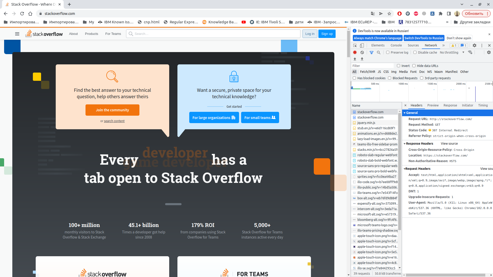
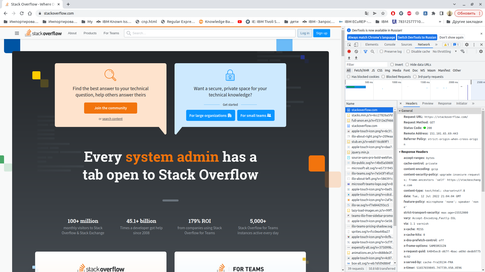
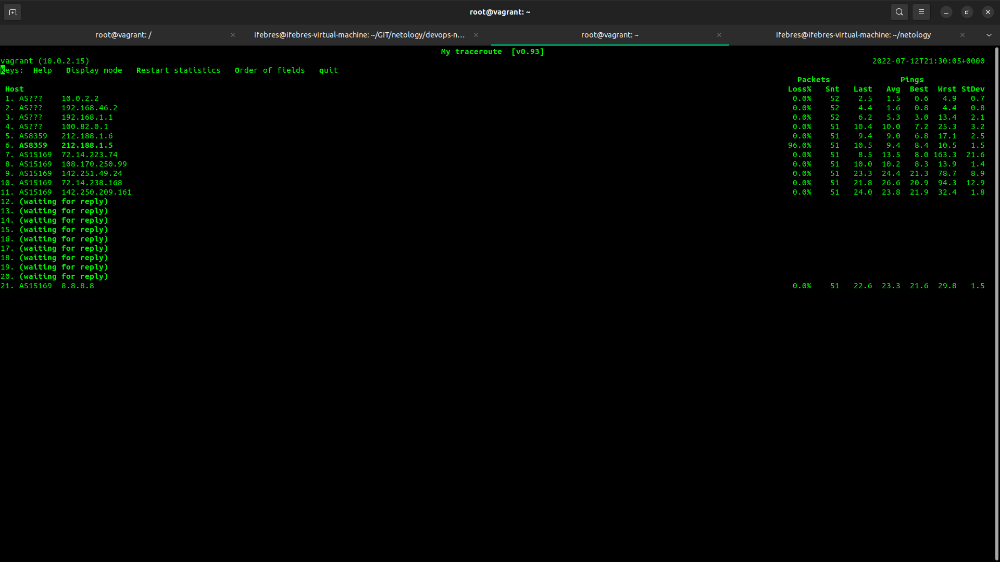

1. 
```commandline
telnet> GET /questions HTTP/1.0
?Invalid command
telnet> quit
Connection closed.
root@vagrant:~# telnet stackoverflow.com 80
Trying 151.101.193.69...
Connected to stackoverflow.com.
Escape character is '^]'.
GET /questions HTTP/1.0
HOST: stackoverflow.com

HTTP/1.1 301 Moved Permanently
cache-control: no-cache, no-store, must-revalidate
location: https://stackoverflow.com/questions
x-request-guid: fd046107-7bb8-4ef3-9590-cafb0dc0a506
feature-policy: microphone 'none'; speaker 'none'
content-security-policy: upgrade-insecure-requests; frame-ancestors 'self' https://stackexchange.com
Accept-Ranges: bytes
Date: Tue, 12 Jul 2022 20:59:07 GMT
Via: 1.1 varnish
Connection: close
X-Served-By: cache-fra19155-FRA
X-Cache: MISS
X-Cache-Hits: 0
X-Timer: S1657659548.867350,VS0,VE93
Vary: Fastly-SSL
X-DNS-Prefetch-Control: off
Set-Cookie: prov=70fed38f-fded-005f-973e-4529dd3ff796; domain=.stackoverflow.com; expires=Fri, 01-Jan-2055 00:00:00 GMT; path=/; HttpOnly

Connection closed by foreign host.
```
Код состояния HTTP 301 или Moved Permanently (с англ. — «Перемещено навсегда») — стандартный код ответа HTTP, получаемый в ответ от сервера в ситуации, когда запрошенный ресурс был на постоянной основе перемещён в новое месторасположение, и указывающий на то, что текущие ссылки, использующие данный URL, должны быть обновлены. Адрес нового месторасположения ресурса указывается в поле Location получаемого в ответ заголовка пакета протокола HTTP. 

2. HTTP код перенаправления  307 Temporary Redirect означает, что запрошенный ресурс был временно перемещён в URL-адрес, указанный в заголовке Location (en-US).


Самый длинный запрос


3. 
4. 79.139.193.186, Moscow Local Telephone Network (OAO MGTS), AS25513
```commandline
root@vagrant:~# whois 79.139.193.186
% This is the RIPE Database query service.
% The objects are in RPSL format.
%
% The RIPE Database is subject to Terms and Conditions.
% See http://www.ripe.net/db/support/db-terms-conditions.pdf

% Note: this output has been filtered.
%       To receive output for a database update, use the "-B" flag.

% Information related to '79.139.192.0 - 79.139.255.255'

% Abuse contact for '79.139.192.0 - 79.139.255.255' is 'abuse@spd-mgts.ru'

inetnum:        79.139.192.0 - 79.139.255.255
netname:        MGTS-PPPOE
descr:          Moscow Local Telephone Network (OAO MGTS)
country:        RU
admin-c:        USPD-RIPE
tech-c:         USPD-RIPE
status:         ASSIGNED PA
mnt-by:         MGTS-USPD-MNT
created:        2008-06-27T04:35:41Z
last-modified:  2008-07-02T09:49:40Z
source:         RIPE

role:           PJSC Moscow City Telephone Network NOC
address:        USPD MGTS
address:        Moscow, Russia
address:        Khachaturyana 5
admin-c:        AGS9167-RIPE
admin-c:        AVK103-RIPE
admin-c:        GIA45-RIPE
tech-c:         AVK103-RIPE
tech-c:         VMK
tech-c:         ANO3-RIPE
abuse-mailbox:  abuse@spd-mgts.ru
nic-hdl:        USPD-RIPE
mnt-by:         MGTS-USPD-MNT
created:        2006-09-11T07:56:01Z
last-modified:  2022-04-04T16:36:51Z
source:         RIPE # Filtered

% Information related to '79.139.128.0/17AS25513'

route:          79.139.128.0/17
descr:          Moscow Local Telephone Network (OAO MGTS)
descr:          Moscow, Russia
origin:         AS25513
mnt-by:         MGTS-USPD-MNT
created:        2007-11-01T11:08:49Z
last-modified:  2007-11-01T11:08:49Z
source:         RIPE

% This query was served by the RIPE Database Query Service version 1.103 (ANGUS)
```
5. AS8359,AS15169
```
root@vagrant:~# traceroute -IAn 8.8.8.8
traceroute to 8.8.8.8 (8.8.8.8), 30 hops max, 60 byte packets
 1  10.0.2.2 [*]  0.615 ms  0.499 ms  2.836 ms
 2  192.168.46.2 [*]  4.716 ms  4.617 ms  4.553 ms
 3  192.168.1.1 [*]  5.290 ms  5.215 ms  5.116 ms
 4  100.82.0.1 [*]  8.516 ms  8.467 ms  9.293 ms
 5  212.188.1.6 [AS8359]  9.244 ms  9.196 ms  9.147 ms
 6  * * *
 7  72.14.223.74 [AS15169]  8.566 ms  8.381 ms  8.233 ms
 8  108.170.250.99 [AS15169]  8.941 ms  8.696 ms  8.545 ms
 9  142.251.49.24 [AS15169]  22.775 ms  22.495 ms  22.417 ms
10  72.14.238.168 [AS15169]  22.197 ms  22.022 ms  21.940 ms
11  142.250.209.161 [AS15169]  21.819 ms  21.680 ms  21.566 ms
12  * * *
13  * * *
14  * * *
15  * * *
16  * * *
17  * * *
18  * * *
19  * * *
20  * * *
21  8.8.8.8 [AS15169]  22.059 ms  21.936 ms  21.826 ms
```
6. 
HOST — имя хоста;  
Loss % — процент потерянных пакетов;  
Snt — количество отправленных пакетов;  
Last — время задержки последнего полученного пакета;  
Avg — среднее время задержки;  
Best — минимальное время задержки;  
Wrst — максимальное время задержки;  
StDev — среднеквадратичное отклонение времени задержки.  
Максимальная задержка на AS15169  72.14.223.74    

7. dns.google.		151	IN	A	8.8.8.8  
dns.google.		151	IN	A	8.8.4.4
```
root@vagrant:~# dig dns.google

; <<>> DiG 9.16.1-Ubuntu <<>> dns.google
;; global options: +cmd
;; Got answer:
;; ->>HEADER<<- opcode: QUERY, status: NOERROR, id: 63894
;; flags: qr rd ra; QUERY: 1, ANSWER: 2, AUTHORITY: 0, ADDITIONAL: 1

;; OPT PSEUDOSECTION:
; EDNS: version: 0, flags:; udp: 65494
;; QUESTION SECTION:
;dns.google.			IN	A

;; ANSWER SECTION:
dns.google.		151	IN	A	8.8.8.8
dns.google.		151	IN	A	8.8.4.4

;; Query time: 24 msec
;; SERVER: 127.0.0.53#53(127.0.0.53)
;; WHEN: Tue Jul 12 21:47:12 UTC 2022
;; MSG SIZE  rcvd: 71
```
8. 
```
root@vagrant:~# dig +noall +answer -x 8.8.8.8
8.8.8.8.in-addr.arpa.	7111	IN	PTR	dns.google.
root@vagrant:~# dig +noall +answer -x 8.8.4.4
4.4.8.8.in-addr.arpa.	7143	IN	PTR	dns.google.

```
