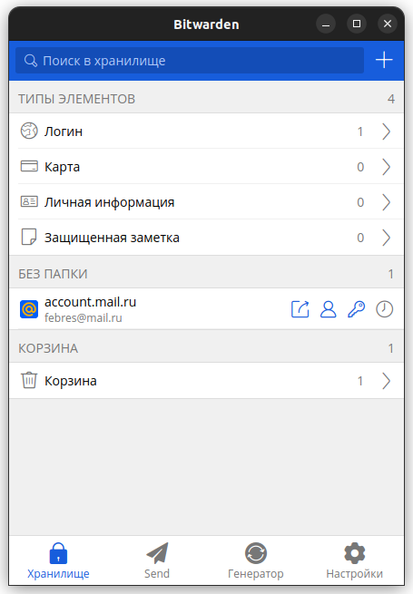
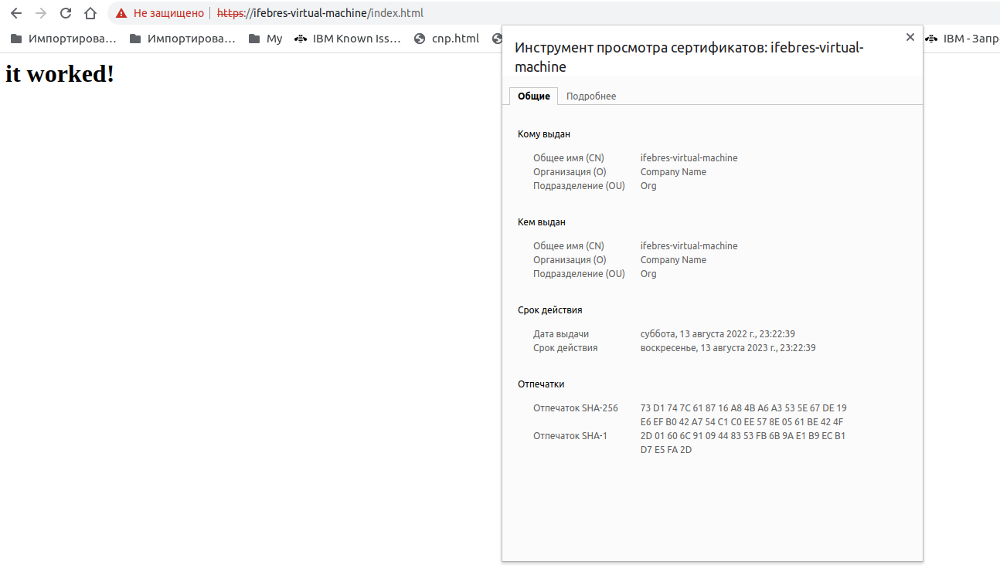
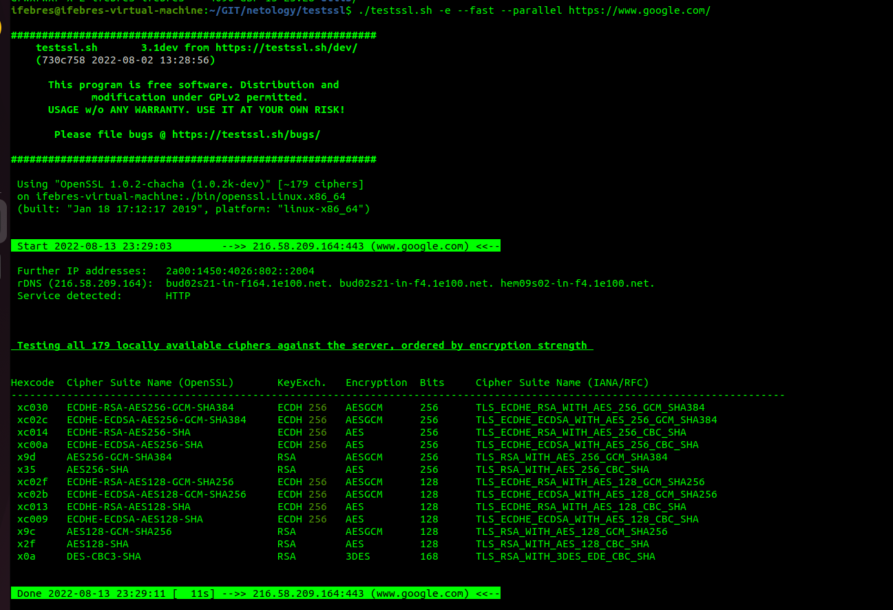
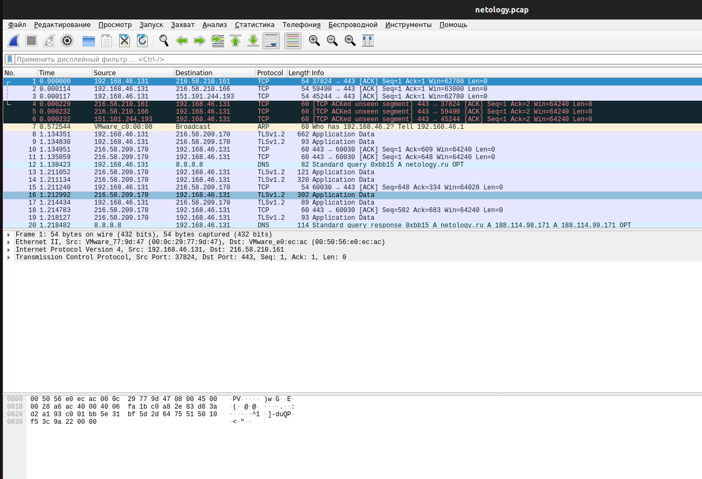

1. 
2. Приложение на телефоне не разрешает сделать скрин. Опишу процесс подключения двухфакторной аутентификации. Авторизуемся в веб-версии личного кабинета https://vault.bitwarden.com/#/vault
 Переходим в настройки аккаунта - Безопасность. Вкладка "Двухфакторная аутентификация".
 Из провайдеров выбираем "Приложение-аутентификатор". Жмём кнопку Управление и сканируем QR-code 
приложением Google authentificator. Вводим полученный код из приложения. Двухфакторная аутентификация включена.
3. Screen  
4. Screen  
5. Создадим пару ключей   
```
ssh-keygen -t rsa
```
Скопируем ключ на удалённый сервер  
```
ssh-copy-id -p 2222 -i ~/.ssh/id_ed25519.pub vagrant@127.0.0.1
ssh-copy-id -i ~/.ssh/id_rsa.pub ifebres@192.168.46.131
```
Подключимся к удалённому хосту без ввода пароля
``` 
ifebres@ifebres-virtual-machine:~/.ssh$ ssh -p 2222 vagrant@127.0.0.1
Welcome to Ubuntu 20.04.4 LTS (GNU/Linux 5.4.0-110-generic x86_64)

 * Documentation:  https://help.ubuntu.com
 * Management:     https://landscape.canonical.com
 * Support:        https://ubuntu.com/advantage

  System information as of Sat 13 Aug 2022 09:46:45 PM UTC

  System load:  0.02               Processes:             117
  Usage of /:   11.9% of 30.63GB   Users logged in:       1
  Memory usage: 21%                IPv4 address for eth0: 10.0.2.15
  Swap usage:   0%


This system is built by the Bento project by Chef Software
More information can be found at https://github.com/chef/bento
Last login: Sat Aug 13 21:45:11 2022 from 10.0.2.2
vagrant@vagrant:~$ 

```
6. Создадим дополнительно файл `config`  
```
ifebres@ifebres-virtual-machine:~/.ssh$ cat config 
Host vagrant
  User vagrant
  Hostname 127.0.0.1
  Port 2222
  IdentityFile ~/.ssh/id_ed25519
```
7. Соберём 100 пакетов в дамп  
```
ifebres@ifebres-virtual-machine:~/.ssh$ sudo tcpdump -vvv -c 100 -s0 -w /opt/netology.pcap
tcpdump: listening on ens33, link-type EN10MB (Ethernet), snapshot length 262144 bytes
100 packets captured
100 packets received by filter
0 packets dropped by kernel
ifebres@ifebres-virtual-machine:~/.ssh$ ll /opt/
итого 32
drwxr-xr-x  3 root    root     4096 авг 14 01:20 ./
drwxr-xr-x 20 root    root     4096 авг 13 16:55 ../
drwxr-xr-x  3 root    root     4096 авг 13 16:55 google/
-rw-r--r--  1 tcpdump tcpdump 18747 авг 14 01:20 netology.pcap
```
