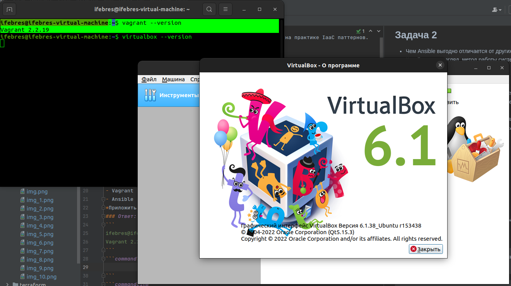

## Задача 1  
- Опишите своими словами основные преимущества применения на практике IaaC паттернов.
- Какой из принципов IaaC является основополагающим?  
### Ответ:
- IaaC позволяет автоматизировать рутинные действия по настройке и управлению инфраструктурой. Исключает ошибки при конфигурировании разных сред(dev/test/prod). Быструю доставку/откат обновлений.
- Основной принцип IaaC - управление и описание инфраструктуры в виде конфигурационных файлов (инфраструктура как код), исключая ручное конфигурирование на самих серверах. 
## Задача 2
- Чем Ansible выгодно отличается от других систем управление конфигурациями?
- Какой, на ваш взгляд, метод работы систем конфигурации более надёжный push или pull?
### Ответ:  
- Ansible не требует установки спец окружения, а использует ssh. 
Ansible поставляется с большим количеством легко подключаемых модулей и может 
использоваться на всех стадиях жизненного цикла проекта.  
- На мой взгляд Push метод более надёжный, т.к. исключает случайные ошибки и человеческий фактор. Инфраструктура заливается из корректных конфигов, позволяя внести нужные изменения перед началом.

## Задача 3
Установить на личный компьютер:

- VirtualBox
- Vagrant
- Ansible  
*Приложить вывод команд установленных версий каждой из программ, оформленный в markdown.*
### Ответ:
```
ifebres@ifebres-virtual-machine:~$ vagrant --version
Vagrant 2.2.19
```


```commandline
ifebres@ifebres-virtual-machine:~$ ansible --version
ansible 2.10.8
  config file = None
  configured module search path = ['/home/ifebres/.ansible/plugins/modules', '/usr/share/ansible/plugins/modules']
  ansible python module location = /usr/lib/python3/dist-packages/ansible
  executable location = /usr/bin/ansible
  python version = 3.10.6 (main, Aug 10 2022, 11:40:04) [GCC 11.3.0]

```
